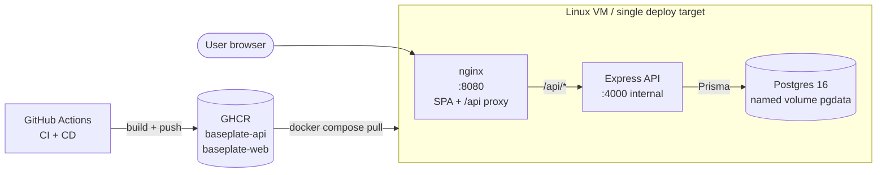

# Hackathon Baseplate

A production-shaped, reusable baseplate for an 11-hour hackathon. pnpm +
Turborepo monorepo, React + Vite web app, Express + TypeScript API on
PostgreSQL, fully containerised, wired to a GitHub Actions CI/CD pipeline
that builds, scans, pushes, deploys and rolls back.

The domain logic is deliberately trivial and disposable ("items": id, name,
quantity, createdAt). What is real and proven is every seam: build, test,
container, pipeline, deploy, observe. The repo is cloned at the start of a
hackathon, the demo domain is deleted with `make reset-domain`, and the
real problem statement is implemented in its place.

## Architecture



Two networks in the prod stack: a `frontend` network that exposes nginx on
:8080, and a `backend` network marked `internal: true` so an RCE in the
API cannot reach the internet. Postgres is on the backend only.

## 60-second local start

```bash
# Prereqs: Node 20+, pnpm 9.15.3, Docker.
# `devbox shell` (recommended) gets all three pinned.

make setup      # install deps, copy .env, generate prisma client
make dev        # dev stack: db + api + web with hot reload
# web:   http://localhost:5173
# api:   http://localhost:4000
```

For the production-shaped local stack:

```bash
make prod       # builds images, runs compose.prod, runs migrations
# web:   http://localhost:8080
make verify-isolation   # assert the prod network posture is correct
```

## Prerequisites

| Tool   | Version  | Where to get it                              |
| ------ | -------- | -------------------------------------------- |
| Node   | 20+ (see `.nvmrc`) | `devbox shell` or `nvm install`     |
| pnpm   | 9.15.3   | `corepack prepare pnpm@9.15.3 --activate`    |
| Docker | 24+      | `docker.com/get-docker`                      |
| `act`  | latest   | optional, for running GitHub Actions locally |

`devbox shell` (a Nix-based shell with the toolchain pinned) is the
recommended way to run this repo. `.devbox/shell_history` and
`devbox.lock` capture the exact pin set.

## Environment variables

Every variable the system reads is in `.env.example`. Copy it to `.env`
(the gitignored file) and adjust. Defaults are safe for local development.

| Variable               | Used by | Default                                 | Notes                                 |
| ---------------------- | ------- | --------------------------------------- | ------------------------------------- |
| `NODE_ENV`             | api     | `development`                           | Affects log format and strictness.    |
| `API_PORT`             | api     | `4000`                                  | Inside the container.                 |
| `LOG_LEVEL`            | api     | `info`                                  | trace / debug / info / warn / error   |
| `DATABASE_URL`         | api     | `postgresql://...localhost:5432/...`    | Use `db` as host in compose.          |
| `TEST_DATABASE_URL`    | api     | `postgresql://.../baseplate_test`       | Separate DB for tests.                |
| `POSTGRES_USER`        | db      | `baseplate`                             |                                       |
| `POSTGRES_PASSWORD`    | db      | (change me)                             | Never commit a real one.              |
| `POSTGRES_DB`          | db      | `baseplate`                             |                                       |
| `CORS_ORIGINS`         | api     | `http://localhost:5173,http://localhost:8080` | Comma-separated exact origins. Must NOT include `*`. |
| `BODY_LIMIT`           | api     | `100kb`                                 | Passed to `express.json`.             |
| `RATE_LIMIT_WINDOW_MS` | api     | `60000`                                 |                                       |
| `RATE_LIMIT_WRITE_MAX` | api     | `60`                                    | Per-process; see ADR-0002.            |
| `SHUTDOWN_TIMEOUT_MS`  | api     | `10000`                                 | SIGTERM -> SIGKILL hard cap.          |
| `VITE_API_URL`         | web     | (build arg, default `/api`)              | Inlined into the bundle. The build FAILS LOUDLY if unset. |
| `WEB_PORT`             | host    | `8080`                                  | The one published port.               |
| `IMAGE_TAG`            | cd      | `latest`                                | Overridden by CD with `sha-<short>`.  |

## API reference

| Method | Path             | Body / Query                  | Headers              | Response |
| ------ | ---------------- | ----------------------------- | -------------------- | -------- |
| GET    | `/health`        | —                             | —                    | `{status:"ok", uptimeSeconds, version}` |
| GET    | `/ready`         | —                             | —                    | `{status:"ready"|"not_ready", checks:{database}}` |
| GET    | `/items`         | `?limit=20&cursor=<uuid>`     | —                    | `{items:[…], nextCursor}` |
| POST   | `/items`         | `{name, quantity?}`           | `Idempotency-Key?`   | `201` + Location header + `Item` |
| GET    | `/items/:id`     | —                             | —                    | `200` + `Item` |

All errors use the envelope:
```json
{ "error": { "code": "VALIDATION_FAILED", "message": "...", "requestId": "...", "details": [...] } }
```

`code` is one of: `VALIDATION_FAILED`, `NOT_FOUND`, `CONFLICT`,
`IDEMPOTENCY_KEY_CONFLICT`, `PAYLOAD_TOO_LARGE`, `RATE_LIMITED`,
`SERVICE_UNAVAILABLE`, `INTERNAL`.

`message` is the user-safe copy. `details` is populated only for
validation failures. `requestId` is echoed on the response header
`x-request-id` so a user reporting "it failed" can paste one string.

## Tests

| Layer       | Tool                                | Command                  | Run time |
| ----------- | ----------------------------------- | ------------------------ | -------- |
| Unit        | vitest                              | `make test-unit`         | < 1 s    |
| Integration | vitest + supertest + real Postgres  | `make test-integration`  | seconds  |
| E2E         | Playwright + compose.prod           | `make e2e`               | tens of s |

`make test` runs unit + integration. Integration tests use a throwaway
Postgres from `scripts/with-test-db.sh` — they will not pollute the dev
DB.

`make ci-local` runs lint, typecheck, build and tests in the same order
as the CI workflow.

### What `act` cannot faithfully emulate

`act` is great for sanity-checking workflow syntax but:

- It runs Linux containers locally; macOS-specific actions behave
  differently.
- `services: postgres` in CI uses a real GHA-managed container; `act`
  approximates it with `--container-architecture=linux/amd64`.
- `docker/build-push-action` is run inside `act`'s container, NOT
  against the host Docker daemon, so image builds work but pushing
  needs `--secret GITHUB_TOKEN=...`.
- `appleboy/ssh-action` and `mxschmitt/action-tmate` cannot run in
  `act` at all (they require real network egress to GitHub).

For deployment verification, use the real GitHub Actions run.

## Deployment

Push to `main` triggers CI; CI passing triggers CD. The CD workflow:

1. Builds and pushes API and web images to GHCR, tagged with both
   `sha-<short-sha>` and `latest`. Deployments reference the immutable
   SHA.
2. SSHes to the deploy host.
3. `prisma migrate deploy` first (the running app is backward-compatible
   with the OLD schema by design).
4. `docker compose up -d`.
5. Polls `/api/ready` until 200 or 30 attempts.

Required secrets on the repo:
- `DEPLOY_HOST`, `DEPLOY_USER`, `DEPLOY_SSH_KEY` — for the SSH deploy.
- `PUBLIC_URL` — for the GitHub environment URL.

### Rollback

```bash
# On the deploy host:
docker compose -p baseplate-prod -f docker/compose.prod.yaml --env-file .env pull
IMAGE_TAG=sha-abc1234 docker compose -p baseplate-prod -f docker/compose.prod.yaml \
  --env-file .env up -d
```

Full rollback procedure in `docs/runbook.md`.

## Hackathon start

```bash
make reset-domain   # deletes the demo "items" domain
git add -A
git commit -m "reset: remove demo domain"
# Implement your real domain by:
#   - defining zod schemas in packages/contracts/src/
#   - creating apps/api/src/modules/<domain>/{*.repository.ts,*.service.ts,*.handler.ts,*.routes.ts}
#   - mirroring it under apps/web/src/features/<domain>/
#   - writing the migration in apps/api/prisma/migrations/
```

The reset script is safe by default — refuses to run on a dirty worktree
unless `--force` is passed.

## Repository layout

```
apps/
  api/                 Express + TypeScript API
  web/                 React + Vite SPA
packages/
  config/              shared tsconfig, eslint, prettier
  contracts/           zod schemas -> shared DTOs
  logger/              pino + AsyncLocalStorage context + traceparent
docker/                Dockerfiles + compose files
e2e/                   Playwright
docs/                  runbook, ADRs, standards
scripts/               reset-domain, deploy, verify-isolation, etc
.github/
  workflows/           ci.yml, cd.yml, debug.yml
  trivy-allowlist.yaml CVE allowlist with expiry
.agents/               canonical agent instructions + skills
```

## Troubleshooting

| Symptom                                                | Cause                                         | Fix |
| ------------------------------------------------------ | --------------------------------------------- | --- |
| `pnpm install` fails with EACCES                        | Running as root, or a stale `.pnpm-store`     | Use `devbox shell`, or `sudo chown -R $USER:$USER .` |
| `/ready` returns 503 immediately                        | DATABASE_URL is wrong, or Postgres isn't up   | `docker compose ps`, `docker exec db pg_isready` |
| Web loads but every API call 404s                       | `VITE_API_URL` was unset at build time        | Rebuild with the build arg set; the build fails loud if absent |
| `docker compose up` says "port already in use"          | Another stack on the same port                | `make down`, or change `WEB_PORT` in `.env` |
| `prisma migrate deploy` fails with a drift error        | Migration history is dirty                    | `prisma migrate resolve` to mark applied; investigate before merging |
| `act -j lint` errors on env variables                   | `act` doesn't fully support `env:` defaults   | Pin explicit env in the job's `env:` block |
| `docker stop <container>` takes 10s                    | Node isn't handling SIGTERM                   | Verify exec-form ENTRYPOINT; see ADR-0007-style shutdown docs |

For deeper troubleshooting, see `docs/runbook.md`.

## License

Hackathon baseplate. Use freely. Attribution appreciated but not required.