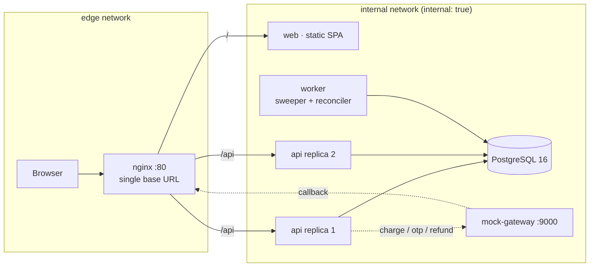
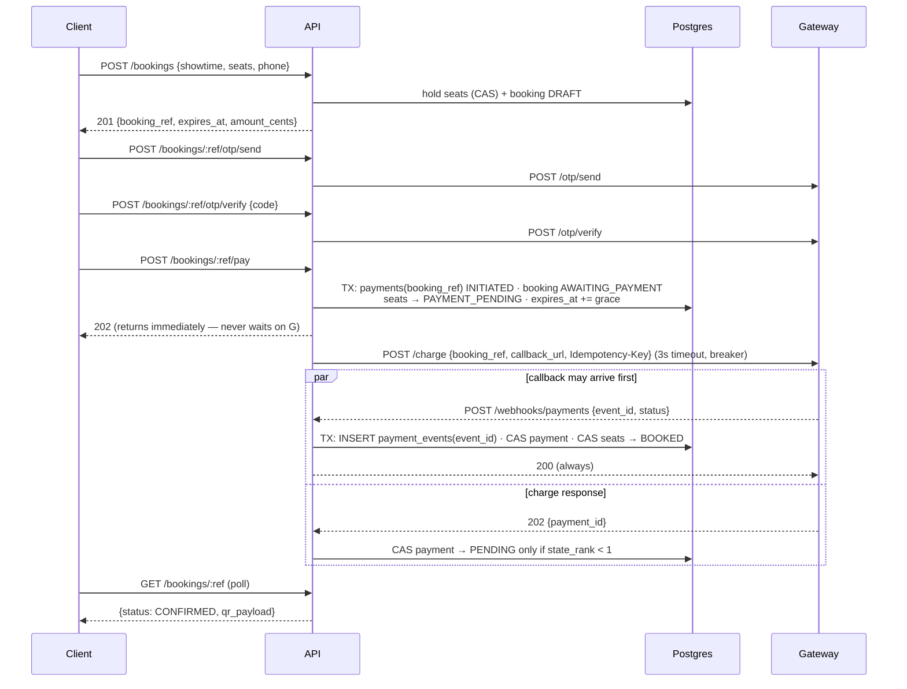

# CinemaSeat — Unified Project Plan

> **Goal:** a movie ticketing system that **never sells the same seat twice**, stays usable when the payment gateway misbehaves, and can be rebuilt from a clean clone with one command.

This document is the engineering design and the record of decisions. The README is the demo and the evidence; the implementation playbook (`temp/IMPLEMENTATION_PLAN.md`) is the hour-by-hour execution order.

---

## 1. The one idea everything else hangs off

Overselling is normally treated as a race to be won with locks. We remove the race instead:

> **Exactly one `seat_inventory` row exists per `(showtime_id, seat_id)`, created at seed time. A booking never inserts seat rows — it only ever flips the state of a row that already exists.**

There is nothing to duplicate. The question "can two people get seat F12?" reduces to "can one row be transitioned out of `AVAILABLE` twice?", and that is decided by a single atomic SQL statement whose affected-row count is the verdict.

Everything below — expiry, payments, callbacks — is arranged so that this remains true even when parts of the system are failing.

**Enforcement ladder** (every invariant pushed to the lowest row that can hold it):

| Invariant | Enforced by | Layer |
| --- | --- | --- |
| One inventory row per seat per showtime | `PRIMARY KEY (showtime_id, seat_id)` | Schema |
| No oversell | Atomic conditional `UPDATE`, `rowcount` is the verdict | Database |
| No duplicate payment effect | `UNIQUE (event_id)` in the same transaction as the effect | Database |
| One payment per booking | `UNIQUE (booking_ref)` on `payments` | Database |
| No backward payment state | `WHERE state_rank < :new_rank` | Database |
| Hold expiry | Predicate evaluated at read and write time, not a background job | Query |

---

## 2. Architecture

### 2.1 Shape

A **modular monolith plus a worker**, both built from the same image and run as separate containers, behind nginx.



Modules inside the API, each owning its tables and exposing a service interface:

| Module | Owns | Responsibility |
| --- | --- | --- |
| `catalog` | movies, theatres, screens, showtimes, seats | read-only browse |
| `inventory` | `seat_inventory`, `holds` | seat map, hold, release, confirm |
| `booking` | `bookings`, `booking_seats` | orchestrates the purchase |
| `payment` | `payments`, `payment_events` | gateway client, callback ingestion |
| `identity` | `otp_challenges` | OTP send/verify |
| `platform` | — | logging, metrics, errors, config, health |

The **worker** runs the same code, different entrypoint: hold sweeper, payment reconciler, refund retrier. It holds a Postgres advisory lock so it is safe to run more than one replica — only one sweeps at a time.

### 2.2 Why not microservices

Seat holding, booking state and payment settlement all mutate the same consistency boundary. Splitting them means a distributed transaction, which means an outbox, a saga and a compensating-transaction path — three new failure modes to build and defend in eight hours, buying scalability we do not need at this scale.

What we *did* split is by **workload shape**, which is where the real benefit is: latency-sensitive request handling (API, horizontally scaled) versus background reconciliation (worker, singleton). We can run `--scale api=4` today; the module boundaries are drawn so that `inventory` or `payment` could be lifted into their own service without touching call sites.

**What it cost us:** one deploy unit, so a bad `catalog` change can take down booking; and one database, so the seat map competes with writes for connections. Both are accepted, documented in §3.

---

## 3. Decisions — the three real arguments

Format: options considered → chosen → why → what we gave up.

1. **Postgres row-level CAS vs Redis `SET NX` for holds.** Gave up peak throughput; bought a single source of truth that survives an eviction and a reaper that is not a load-bearing component.
2. **Modular monolith vs microservices.** Gave up independent scaling and blast-radius isolation; bought one transactional boundary and no saga.
3. **Lazy expiry predicate vs a reaper as the authority.** Gave up simplicity of a single mechanism; bought correctness that survives the worker being dead.

> *If the real arguments were different, the canonical alternatives are: async `202` + polling vs holding the request open for the callback; extending the hold at payment start vs auto-refunding on late success.*

---

## 4. Data model

Money is **integer cents**, always. No floats touch a currency value anywhere. All timestamps are `timestamptz`, generated by the **database** (`now()`), never the application — replicas have skewed clocks and hold expiry must not depend on which container served the request.

```sql
movies      (id, title, poster_url, duration_min, certificate)
theatres    (id, name, city)
screens     (id, theatre_id, name)
seats       (id, screen_id, row_label, seat_number, seat_class)   -- physical
showtimes   (id, movie_id, screen_id, starts_at, base_price_cents, currency)

seat_inventory (
  showtime_id uuid,
  seat_id     uuid,
  status      seat_status NOT NULL DEFAULT 'AVAILABLE',
  hold_id     uuid NULL,
  booking_id  uuid NULL,
  expires_at  timestamptz NULL,
  price_cents integer NOT NULL,
  version     integer NOT NULL DEFAULT 0,
  updated_at  timestamptz NOT NULL DEFAULT now(),
  PRIMARY KEY (showtime_id, seat_id)
)
-- seat_status: AVAILABLE | HELD | PAYMENT_PENDING | BOOKED

holds       (id, showtime_id, user_ref, status, expires_at, created_at)
bookings    (id, ref UNIQUE, showtime_id, hold_id, user_ref, phone,
             status, state_rank, total_cents, created_at, confirmed_at)
booking_seats (booking_id, seat_id, price_cents, PRIMARY KEY (booking_id, seat_id))

payments (
  id uuid PK,
  booking_ref text UNIQUE NOT NULL,        -- our correlation key, not theirs
  gateway_payment_id text NULL,            -- learned later, possibly never
  status payment_status NOT NULL,
  state_rank smallint NOT NULL,
  amount_cents integer NOT NULL,
  attempts smallint NOT NULL DEFAULT 0,
  created_at timestamptz, updated_at timestamptz
)

payment_events (                            -- the idempotency ledger
  event_id text PRIMARY KEY,                -- gateway's evt_xxx
  booking_ref text NOT NULL,
  status text NOT NULL,
  payload jsonb NOT NULL,
  received_at timestamptz DEFAULT now(),
  applied boolean NOT NULL DEFAULT false
)

otp_challenges (ref PK, phone, sent_at, verified_at, attempts, resend_count)
audit_log      (id, at, request_id, actor, action, entity, entity_id, detail jsonb)
```

Indexes that earn their keep:

```sql
CREATE INDEX ON seat_inventory (showtime_id);                       -- seat map
CREATE INDEX ON seat_inventory (expires_at)
  WHERE status IN ('HELD','PAYMENT_PENDING');                       -- sweeper
CREATE INDEX ON payments (status, updated_at)
  WHERE status IN ('INITIATED','PENDING');                          -- reconciler
CREATE INDEX ON bookings (ref);
```

Both sweeper indexes are **partial** — they index only the rows the background jobs actually scan, so they stay small no matter how many bookings accumulate.

### Seeding

`prisma/seed.ts` populates 4 movies, 2 theatres, 4 screens, ~12 showtimes and a full `seat_inventory` grid (10 rows × 12 seats = 120 rows per showtime). Seeding is **idempotent** — it upserts on natural keys, so re-running it on a live database is safe. It runs from the API container entrypoint only when `SEED_ON_BOOT=true`, so `docker compose up` from a clean clone works with no manual step (a judging hook).

---

## 5. The hold path — correctness under concurrency

### 5.1 Single-seat hold: one statement, no transaction ceremony

```sql
UPDATE seat_inventory
   SET status      = 'HELD',
       hold_id     = $3,
       booking_id  = NULL,
       expires_at  = now() + make_interval(secs => $4),
       version     = version + 1,
       updated_at  = now()
 WHERE showtime_id = $1
   AND seat_id     = $2
   AND ( status = 'AVAILABLE'
      OR (status IN ('HELD','PAYMENT_PENDING') AND expires_at < now()) )
RETURNING seat_id, price_cents, expires_at;
```

* `rowcount = 1` → **you hold the seat**. `201`.
* `rowcount = 0` → someone else holds it, or it is booked. **`409 SEAT_UNAVAILABLE`.**

Three properties worth stating out loud:

1. **It is a compare-and-swap.** The `WHERE` clause is the compare; the `SET` is the swap; `rowcount` is the result. Postgres row locking guarantees that of N concurrent statements targeting this row, exactly one observes the old state. Under 100 concurrent requests the other 99 re-evaluate the predicate *after* the winner commits, see `status = 'HELD'` with a future `expires_at`, and match zero rows.
2. **Expiry is lazy and free.** The second `OR` branch reclaims an expired hold in the same statement. Correctness does **not** depend on a background job running — the sweeper is housekeeping, not a load-bearing component.
3. **No deadlock is possible.** One statement, one row.

### 5.2 Multi-seat hold: deterministic lock ordering

Two concurrent requests for `{F11, F12}` and `{F12, F11}` can deadlock if they take row locks in different orders. The fix is to force an order:

```sql
BEGIN;
SET LOCAL lock_timeout = '3s';

SELECT seat_id, status, expires_at, price_cents
  FROM seat_inventory
 WHERE showtime_id = $1 AND seat_id = ANY($2::uuid[])
 ORDER BY seat_id                       -- ← deterministic lock acquisition order
   FOR UPDATE;

-- all-or-nothing: every requested seat must be AVAILABLE or an expired hold
-- else ROLLBACK and 409 with the list of contested seats

UPDATE seat_inventory SET ... WHERE showtime_id = $1 AND seat_id = ANY($2);
COMMIT;
```

`ORDER BY ... FOR UPDATE` makes lock acquisition order a function of `seat_id` alone, identical for every transaction, so a cycle cannot form. `lock_timeout` means a pathological wait fails fast with a `409` instead of holding a connection.

### 5.3 The seat map is a read model, never an authority

```sql
SELECT seat_id, row_label, seat_number, price_cents,
       CASE WHEN status IN ('HELD','PAYMENT_PENDING') AND expires_at < now()
            THEN 'AVAILABLE' ELSE status::text END AS status
  FROM seat_inventory JOIN seats USING (seat_id)
 WHERE showtime_id = $1
 ORDER BY row_label, seat_number;
```

The map may be served from a **1-second TTL cache** under load. That is safe precisely because a click on a stale map is resolved by the hold statement, which is authoritative and will reject it. *Optimistic read, authoritative write* — we never let a cache decide who gets a seat.

`ETag` / `If-None-Match` on the seat map so polling clients get `304`s under a premiere rush instead of full payloads.

### 5.4 Hold expiry

| Mechanism | Role | Consequence if it stops |
| --- | --- | --- |
| Predicate in hold `UPDATE` and seat-map `SELECT` | **Authoritative** | — |
| Worker sweeper, every `SWEEP_INTERVAL_SECONDS` | Housekeeping + metrics | Rows stay stale in storage; behaviour unchanged |

Sweeper statement (batched, contention-free):

```sql
WITH expired AS (
  SELECT showtime_id, seat_id FROM seat_inventory
   WHERE status IN ('HELD','PAYMENT_PENDING') AND expires_at < now()
   LIMIT 500 FOR UPDATE SKIP LOCKED
)
UPDATE seat_inventory si
   SET status='AVAILABLE', hold_id=NULL, booking_id=NULL,
       expires_at=NULL, version=version+1, updated_at=now()
  FROM expired e
 WHERE si.showtime_id=e.showtime_id AND si.seat_id=e.seat_id
RETURNING si.seat_id;
```

`FOR UPDATE SKIP LOCKED` means the sweeper never blocks a live hold and never fights another sweeper replica. `HOLD_TTL_SECONDS` and `SWEEP_INTERVAL_SECONDS` are both environment-driven (judging hook #2).

---

## 6. The payment path — designing for a gateway that lies

The gateway's misbehaviour table is the specification. Each row gets a named defence.

| Documented behaviour | Defence |
| --- | --- |
| Callback delayed 2–15 s | `/pay` is async: it returns `202` immediately and never waits |
| `FAILED` 10 % | Terminal-state handler releases seats and marks the booking `FAILED` |
| Duplicate callback 8 % | `UNIQUE (event_id)` inserted in the **same transaction** as the effect |
| `/charge` 500 or timeout 2 % | Payment row exists *before* the call; reconciler resolves it |
| OTP delayed / never 10 % | Resend with backoff, attempt cap, hold clock shown to the user |
| `X-Mock-Force: race` (callback before `/charge` returns) | `booking_ref` is our key, generated first; monotonic rank prevents the late `202` overwriting a terminal state |
| `X-Mock-Force: timeout` | Reconciler marks `TIMED_OUT` at 45 s; `Idempotency-Key` lets a re-charge be safe |
| `X-Mock-Force: duplicate` | One booking, one confirmation, revenue counted once |
| `X-Mock-Force: fail` | Seats released, booking `FAILED` |

### 6.1 Sequence



### 6.2 The `booking_ref`-first rule

We generate `booking_ref` and **insert the `payments` row before calling `/charge`.** This is what makes `X-Mock-Force: race` a non-event: a callback that arrives before the charge response finds a row to correlate against. Systems that key on the gateway's `payment_id` cannot handle this case at all, because they have not learned the id yet.

### 6.3 Monotonic state ranks

```
INITIATED 0  →  PENDING 1  →  TIMED_OUT 2  →  SUCCEEDED 3 | FAILED 3  →  REFUNDED 4
```

Every payment transition is:

```sql
UPDATE payments
   SET status = $2, state_rank = $3, gateway_payment_id = COALESCE(gateway_payment_id, $4),
       updated_at = now()
 WHERE booking_ref = $1 AND state_rank < $3;
```

* A late `202 PENDING` arriving after a `SUCCEEDED` callback → `rowcount 0`, ignored.
* A duplicate `SUCCEEDED` → `rowcount 0`, ignored (and already stopped at the event ledger).
* A genuine `SUCCEEDED` arriving after our reconciler gave up (`TIMED_OUT`) → **applies**, because 3 > 2, and then triggers auto-refund if the seat is gone.

`COALESCE` means we never null out a `payment_id` we already learned.

### 6.4 Callback handler — the exact contract

```
POST /webhooks/payments
```

1. **Verify signature** if `GATEWAY_WEBHOOK_SECRET` is set (HMAC over the raw body — the raw-body middleware must run before JSON parsing). Failure → `401`, metric, log. Documented deliberate deviation from "always 200": an unsigned request is not from the gateway, so gateway retry semantics do not apply.
2. **One transaction:**
   ```sql
   INSERT INTO payment_events (event_id, booking_ref, status, payload) VALUES (...);
   -- unique violation ⇒ duplicate ⇒ COMMIT, return 200, no effect
   ```
   The dedupe row and the business effect commit **together**. Written in two transactions, a crash between them either double-confirms or loses the event forever.
3. Apply the payment CAS (§6.3). `rowcount 0` → stale/out-of-order → `200`, done.
4. Apply the effect:
   * `SUCCEEDED` → CAS seats `HELD|PAYMENT_PENDING → BOOKED` **for this booking's `hold_id`**; booking → `CONFIRMED`. If `rowcount < seat count` (hold expired and the seat was taken) → booking → `REFUND_REQUIRED`, enqueue refund. *We never confirm a seat we no longer own, and we never keep money for a seat we could not deliver.*
   * `FAILED` → release seats → `AVAILABLE`; booking → `FAILED`.
   * `REFUNDED` → booking → `REFUNDED`, seats released if still ours.
5. Mark `payment_events.applied = true`. **Return `200`.**

> **The callback handler has a hard 5-second budget (`CALLBACK_TIMEOUT_MS = 5000`, 8 retries on non-2xx).** No outbound gateway call inside it — the auto-refund path must **enqueue** the refund, never call `/refund` inline. A slow handler manufactures the duplicate storm the ledger exists to survive.

### 6.5 Timeout is not failure

The single most important distinction in this system:

| Failure at `/charge` | What we know | Action |
| --- | --- | --- |
| `ECONNREFUSED` / DNS failure | The request **never reached** the gateway | Safe to retry |
| Timeout / socket hang-up | **Unknown** — the charge may exist | **If `Idempotency-Key` was sent, retry is safe (same `payment_id`, no double charge).** Otherwise: leave `INITIATED`, let the reconciler resolve. |
| `5xx` response | Gateway received it and failed | Retry once with jitter, then reconcile |

> **Gateway contract update:** `/charge` accepts an `Idempotency-Key`. This *overturns* the earlier "timeout is never retryable" rule. The principle is unchanged: without a key, timeout is unresolvable so you reconcile; with a key, at-most-once becomes at-least-once-plus-dedupe, which is strictly better. The reconciler now **re-charges** rather than giving up.

A blind retry on timeout is how you double-charge a donor, and it is exactly what destroyed the fictional platform in the brief.

**Reconciler** (worker, every `RECONCILE_INTERVAL_SECONDS`): payments still `INITIATED`/`PENDING` older than `PAYMENT_TIMEOUT_SECONDS` → `TIMED_OUT`, release seats, booking → `FAILED`. Rank 2 leaves the door open for a late genuine `SUCCEEDED` to arrive and be handled correctly.

---

## 7. Resilience

**Circuit breaker** around the gateway client (closed → open after 5 consecutive failures → half-open probe after 15 s). While open, `/pay` returns `503 PAYMENT_UNAVAILABLE` — not a 500 — and browse, seat maps and holds are untouched. Its purpose is not to protect us; it is to stop hammering a service that is trying to recover.

**Health vs readiness — different questions, different endpoints:**

| Endpoint | Checks | Judging hook |
| --- | --- | --- |
| `GET /health` | Process is alive. Static `200`. Touches **nothing**. | Stays `200` with the gateway down, `< 1 s`, always |
| `GET /ready` | Database reachable. `503` when not. | Used by compose `depends_on` and nginx |

The gateway is a **degraded-mode dependency, not a readiness dependency.** With `docker compose stop gateway`: browse, seat map, hold, expiry, and `/health` all work; only `/pay` degrades, to a `503` with a user-safe message. Pending payments resume when it returns (reconciler retries only the provably-unsent ones, §6.5).

**Backpressure:** every outbound gateway call has a 3 s timeout; the DB pool is sized deliberately (§9); the process sheds load with `503` rather than queueing unboundedly. A hung request holds a connection, a socket and a thread, and it cascades — failing fast is a feature.

**Graceful shutdown:** `init: true` in compose so PID 1 forwards signals; on `SIGTERM` the API stops accepting connections, drains in-flight requests, closes the pool, exits — with a 10 s hard cap. This is what lets nginx keep serving from the other replica during a deploy.

---

## 8. API surface

Single base URL through nginx: `http://<host>/api/...`

| Method | Path | Purpose |
| --- | --- | --- |
| `GET` | `/health` | liveness, static 200 |
| `GET` | `/ready` | readiness (DB) |
| `GET` | `/metrics` | Prometheus |
| `GET` | `/api/movies` | browse |
| `GET` | `/api/showtimes?movieId=` | showtimes |
| `GET` | **`/api/showtimes/:id/seats`** | **seat map (judging hook #3)** |
| `POST` | **`/api/bookings`** | **hold seats (judging hook #3)** |
| `GET` | `/api/bookings/:ref` | poll status |
| `DELETE` | `/api/bookings/:ref/hold` | release early |
| `POST` | `/api/bookings/:ref/otp/send` · `/verify` | OTP |
| `POST` | **`/api/bookings/:ref/pay`** | **start payment, returns `202`. Accepts and forwards `X-Mock-Force` / `X-Mock-Mode` to the gateway.** |
| `POST` | `/api/webhooks/payments` | gateway callback |
| `POST` | `/api/webhooks/otp` | OTP delivery webhook (callback-delivered) |

Uniform error envelope, no internals leaked:

```json
{ "error": { "code": "SEAT_UNAVAILABLE", "message": "…", "requestId": "…",
             "details": { "unavailableSeats": ["F12"] } } }
```

`SEAT_UNAVAILABLE` 409 · `HOLD_EXPIRED` 409 · `OTP_REQUIRED` 403 ·
`OTP_INVALID` 400 · `PAYMENT_UNAVAILABLE` 503 · `RATE_LIMITED` 429 ·
`VALIDATION_FAILED` 400 · `NOT_FOUND` 404.

Every request carries a `requestId` (from `traceparent` / `x-request-id` or generated), held in `AsyncLocalStorage`, stamped on every log line, echoed in every error, and propagated to the gateway as `callback_url` query state.

---

## 9. Performance and the expected breakpoint

**Little's Law** sizes the pool: `L = λW`. A hold CAS costs ~2 ms, so one connection sustains ~500 holds/s; a pool of 10 per API replica covers ~5 000 holds/s of *uncontended* traffic. `max_connections` on Postgres is 100, so we cap at `pool_size × replicas ≤ 40` and leave headroom for the worker and psql.

Where we expect it to break, in order — this is the answer to "what breaks first":

1. **Row lock contention on one seat.** By design. 100 buyers of F12 serialize on one row lock; that is correctness, not a bug. Throughput on a *single seat* is bounded by `1 / CAS latency` ≈ 500/s, and each loser fails in ~2 ms.
2. **Connection pool saturation** on the seat-map path once traffic outgrows the pool. Symptom: p95 climbs while CPU stays low — the signature of queueing. Mitigations already in place: 1 s seat-map cache, ETag/304, `--scale api=N`.
3. **Postgres CPU** on seat-map scans if the cache is disabled.
4. **Event-loop blocking** — avoided: no synchronous crypto, no sync fs, JSON body limit of 100 kB.

Measured in Scenario C, reported with p50/p95/p99 (never averages — a mean hides the 1 % of users having a terrible time) and an explanation of which of the four we actually hit.

---

## 10. Observability

* **Structured JSON logs** (pino) to stdout with `requestId`, `bookingRef`, `eventId`, `seatId`. Authorization headers, OTP codes and phone numbers redacted.
* **`/metrics`** — RED per route (rate, errors, duration histogram) plus domain counters: `holds_created_total`, `holds_rejected_total{reason}`, `holds_expired_total`, `bookings_confirmed_total`, `payment_callbacks_total{status,duplicate}`, `gateway_request_duration_seconds`, `circuit_breaker_state`, `reconciler_actions_total{action}`.
* **Cardinality discipline:** labels are route *templates* (`/api/bookings/:ref`), status classes and outcome enums only. Never `bookingRef`, never `seatId` — a high-cardinality Prometheus label takes your monitoring down during the exact incident it was meant to diagnose. Identifiers live in logs, which are indexed for it.
* **Audit log** — append-only `audit_log` row for every state transition of a seat, booking or payment, with the request id. This is what lets us *prove* Scenario A and B rather than assert them.

---

## 11. Proving it (Milestone 4)

Committed under `loadtest/`, run **from outside the application host**.

**Scenario A — one seat, many buyers.** `loadtest/burst-hold.mjs` opens 100 connections, waits for all to be established, then releases them with `Promise.all` — a true simultaneous burst, not a ramp. Reports: sent, `201`s, `409`s, other, and then re-fetches the seat map to confirm the seat is held exactly once. **Expected: 1 / 99 / 0 / oversell 0.**

**Scenario B — the abandoned hold.** `loadtest/expiry-demo.sh` with `HOLD_TTL_SECONDS=10`: hold as user A, poll the seat map every second logging the observed status, watch the flip to `AVAILABLE`, then hold and pay as user B. Output is a timestamped timeline pasted into the README.

**Scenario C — breakpoint.** `loadtest/k6-ramp.js` ramps VUs against the seat map and hold endpoints until p95 turns upward. We report the knee, the error onset, and *which* of the four bottlenecks in §9 it was, with the metric that proves it. Magnitude is explicitly not the claim — the methodology and the diagnosis are.

---

## 12. Configuration

Every value below is environment-driven; `.env.example` is committed, `.env` is not.

| Variable | Default | Notes |
| --- | --- | --- |
| `HOLD_TTL_SECONDS` | `300` | **Judging hook #2.** Judges will set this low |
| `PAYMENT_GRACE_SECONDS` | `120` | hold extension once payment starts |
| `PAYMENT_TIMEOUT_SECONDS` | `45` | reconciler gives up, marks `TIMED_OUT` |
| `SWEEP_INTERVAL_SECONDS` | `5` | housekeeping only |
| `RECONCILE_INTERVAL_SECONDS` | `10` | |
| `GATEWAY_BASE_URL` | `http://gateway:9000` | |
| `GATEWAY_TIMEOUT_MS` | `3000` | |
| `GATEWAY_WEBHOOK_SECRET` | *(unset)* | signature verification when present |
| `PUBLIC_CALLBACK_URL` | — | what we hand the gateway as `callback_url` |
| `SEAT_MAP_CACHE_MS` | `1000` | `0` disables |
| `DB_POOL_SIZE` | `10` | per replica; see §9 |
| `API_REPLICAS` | `2` | nginx upstream |
| `SEED_ON_BOOT` | `true` | clean-clone requirement |

> **Gateway behaviour notes (discovers, not assumes):**
> - `/charge` accepts an `Idempotency-Key` — use it on every charge call.
> - Judges send force headers through **your** API: `/pay` must accept and forward `X-Mock-Force` / `X-Mock-Mode`. README must document the exact curl.
> - Callback budget is `CALLBACK_TIMEOUT_MS = 5000` with 8 retries on non-2xx. **No outbound gateway call inside the callback handler.**
> - OTP is delivered via callback (`/webhooks/otp`) — shape unknown until the first probe at 09:40. Capture the raw body and parse from the wire.
> - Gateway state is **in-memory**; a restart wipes payments. Recovery is **re-charge**, not wait.

---

## 13. Delivery

**Containers:** multi-stage builds; dependency layer copied before source so a code edit does not bust the install cache; production deps only in the runtime stage; `USER node`; `HEALTHCHECK`; `init: true`. Postgres publishes **no** port and sits on an `internal: true` network with the API; only nginx is exposed.

**CI** (`ci.yml`, on PR and on push to `main`): lint · typecheck · unit · integration (against a `services: postgres`) · secret scan · Trivy — the first five in parallel, then image build with buildx layer cache and image scan. Actions pinned to commit SHAs, minimal `permissions`, concurrency group with `cancel-in-progress`, path filters so a web-only change skips the API suite. `main` is protected: no merge without green CI.

**CD** (`cd.yml`, on push to `main` only): push both images to **GHCR** (not ECR — public packages mean the EC2 host pulls with zero credentials, removing an entire auth failure mode) tagged `sha-<short>` *and* `latest`; deploy references the immutable SHA tag; **SSM Run Command over SSH** (no inbound port 22, no private key in GitHub Secrets, security group open only on 80) — falls back to SSH if the lab IAM denies instance-profile permissions; `compose pull && up -d`, `prisma migrate deploy`, then poll the public `/ready` until healthy or fail the job. Rollback is redeploying the previous SHA tag — one command, in `docs/runbook.md`.

**Reachability during deploy:** two API replicas behind nginx with `proxy_next_upstream error timeout http_502 http_503`, container healthchecks and graceful shutdown, so a replaced replica drains rather than drops.

**Infrastructure is disposable.** Nothing is hand-configured on the VM. The host runs `docker compose -f compose.prod.yaml up -d` against images from GHCR; if the lab evaporates, a new host reproduces it from the repository alone.

> **Lab account reality:** the lab creds die ~12 hours after launch, but Poridhi reviews submissions 1–2 days later. The deployed URL will be dead when they do the deep review. The deploy is worth points *during judging*; after that only evidence is. Capture a screen recording and timestamped `curl` output against the public URL, commit them to `docs/proof/`, and state the expiry honestly in the README next to the one-command recreate. Credential lifetime is the other landmine — lab STS temporaries may have a session token that expires; a 5-minute probe at 09:35 detects which kind we have, and `refresh-gh-secrets.sh` is the escape hatch.

---

## 14. Documentation and proof

The README is the presentation. First screen answers a judge's first three questions.

```
# CinemaSeat
> One line: what it is, and the guarantee (never sells the same seat twice).

## 🔗 Live: <url>   ·   Run locally: `docker compose up`

## Judging hooks              ← FIRST SCREEN, verbatim from the brief
| Hook | Where |
| GET /health < 1s, green with gateway down | `curl <url>/health` |
| HOLD_TTL_SECONDS from env | .env.example line N, docker compose run example |
| Hold a seat  | POST /api/bookings  + full curl with body |
| Fetch seat map | GET /api/showtimes/:id/seats + full curl |
| Clean clone → up | `git clone && docker compose up` |

## Proof                      ← the numbers, above the architecture
Scenario A: 100 concurrent → 1 hold, 99 rejected, oversell 0  [raw output]
Scenario B: timeline, seat released at T+10s, rebooked at T+13s  [raw output]
Scenario C: p95 knee at N VUs, bottleneck was X, here is the metric

## How it never double-books  ← the one idea, 5 lines + the SQL
## Architecture               ← mermaid + pipeline diagram
## What works / what doesn't  ← be honest, it scores
## API reference · Config · Local setup · Deploy · Rollback · Attribution
```

Put the **exact copy-pasteable curl commands** for hold and seat map in a fenced block. A judge who has to construct a request from prose is a judge losing patience.

---

## 15. The five defence answers — rehearse these out loud

1. **"Why these boundaries?"** — Split by workload shape, not by noun. Seats, bookings and payments share one consistency boundary, so splitting them would have bought a saga and cost us correctness. We split API from worker because one is latency-sensitive and one is background, and that split is what lets us scale the API to N replicas today.
2. **"Walk us through a hold."** — nginx → API → one SQL statement that compares and swaps the seat's state with an expiry-reclaim predicate baked into the `WHERE`. `rowcount` is the verdict. No application lock is ever held. There is exactly one row per seat per showtime, seeded up front, so overselling is not a race we win — it is unrepresentable.
3. **"What breaks first under load?"** — Little's Law puts our pool at 10 per replica against a 2 ms hold. First is row-lock contention on a single hot seat, which is by design; then connection-pool queueing on the seat map, visible as p95 rising while CPU stays flat; then Postgres CPU if we disable the 1-second seat-map cache. Here is the metric where we saw it.
4. **"What did you cut?"** — Multi-seat lock ordering beyond the deterministic path, admin portal, refund UI, Redis cache, AWS. We protected the pipeline and the deployment over the feature list, deliberately.
5. **"What wouldn't you ship?"** — The in-memory rate limiter, because it is per-process and wrong behind multiple replicas; that moves to Redis first. And the callback handler needs a dead-letter path — right now an event that throws after the ledger insert is retried by the gateway, but we would rather park it than depend on that.

---

## 16. Rules discipline

- Repo created **after** the opening session, public at submission.
- README states the scaffold's public origin and that all domain code was written today. Attribute the gateway image and every library.
- `BUILD_PLAN.local.md` and any other local-only plan files are gitignored and never commit.
- No push to `main` after the freeze.
- Commit often. The history is evidence.
